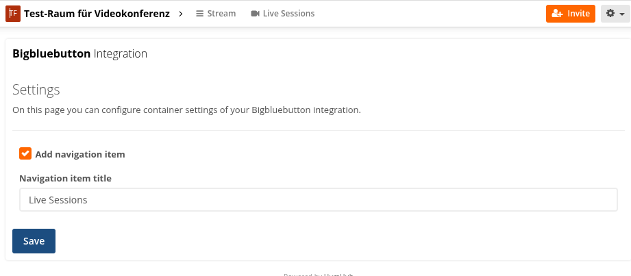
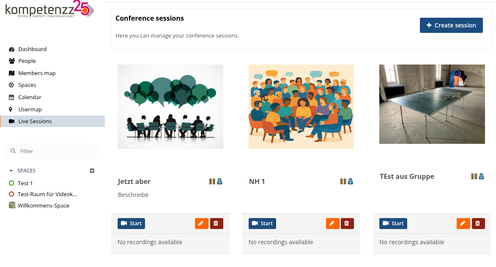
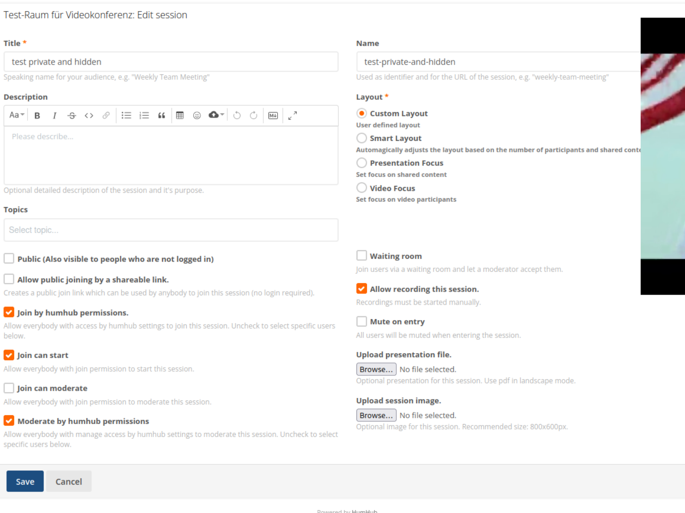
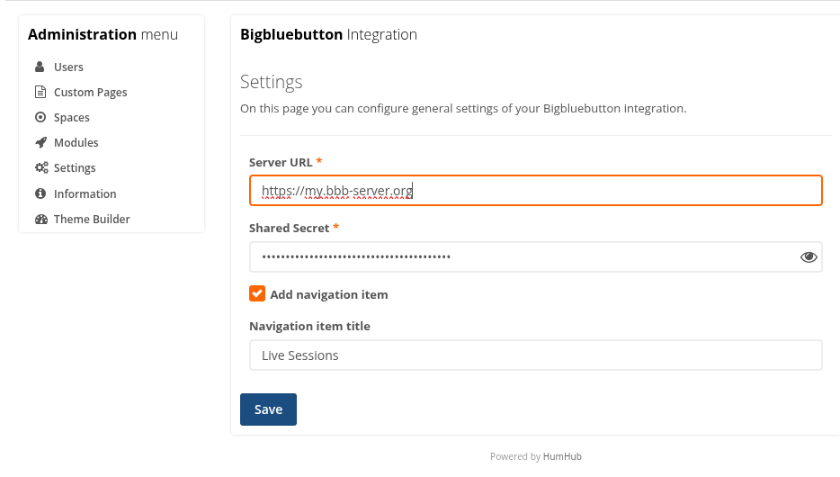

# kompetenzZ BigBlueButton Module for HumHub

This module integrates a BigBlueButton (BBB) video conferencing solution into your HumHub installation. It allows users to create, join, and manage BBB meetings directly within HumHub spaces and user profiles.

Grateful to benefit from the georgeous [official BBB API](https://github.com/bigbluebutton/bigbluebutton-api-php).

## Features
- Seamless integration of BigBlueButton meetings in HumHub
- Create and join video conference sessions from spaces or user profiles
- Permission management for starting and joining sessions
- Customizable via configuration for globals and container contexts

## Screenshots

## Installation
1. Copy the `bbb` module directory into your `humhub/modules-custom/` folder.
2. Install dependencies via composer.
3. Enable the module in the HumHub administration area.

## Configuration
- Configure your BBB server URL and shared secret in the module settings after activation.

## Usage
- Navigate globals menu entry or to a space or user profile and use the BBB menu to create or join meetings (after enabling module).
- Permissions for starting and joining sessions can be managed global, per space or per bbb session.

## License
This module is licensed under the GNU General Public License v3.0. See the `LICENSE` file for details.

## Authors
- kompetenzZ Team
- Contributors welcome!
